# Turmite (2D Turing Machine) Visual Representation

This document contains visual representations of the Turmite implementation in the codebase.

## Overview

The code implements a **2D Turmite** (also called a "Langton's Ant" variant), which is a type of cellular automaton that acts like a 2D Turing machine. Unlike traditional 1D Turing machines that move along a tape, turmites move on a 2D grid and can turn left or right based on the cell state they're standing on.

### Key Differences from Traditional Turing Machines:
- **2D Grid** instead of 1D tape
- **Movement** is forward in current direction (N/E/S/W)
- **Turning** happens before moving (L or R based on cell state)
- **State** is stored in grid cells, not in the machine head
- **Multiple turmites** can run simultaneously

## 1. State Transition Diagram

The core Turing machine logic: cell states and transitions

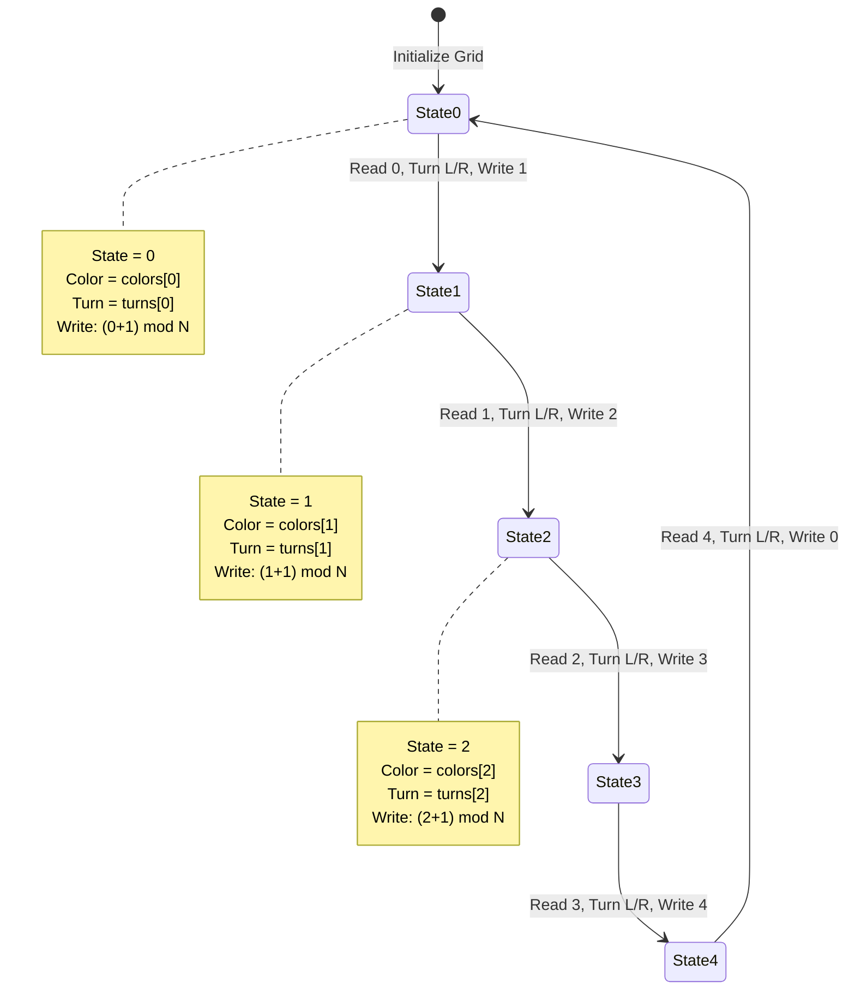

## 2. Turmite Algorithm Flowchart

Complete step-by-step process of a single turmite operation

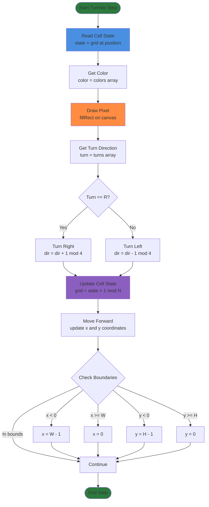

## 3. Direction State Machine

Turmite direction transitions (N=0, E=1, S=2, W=3)

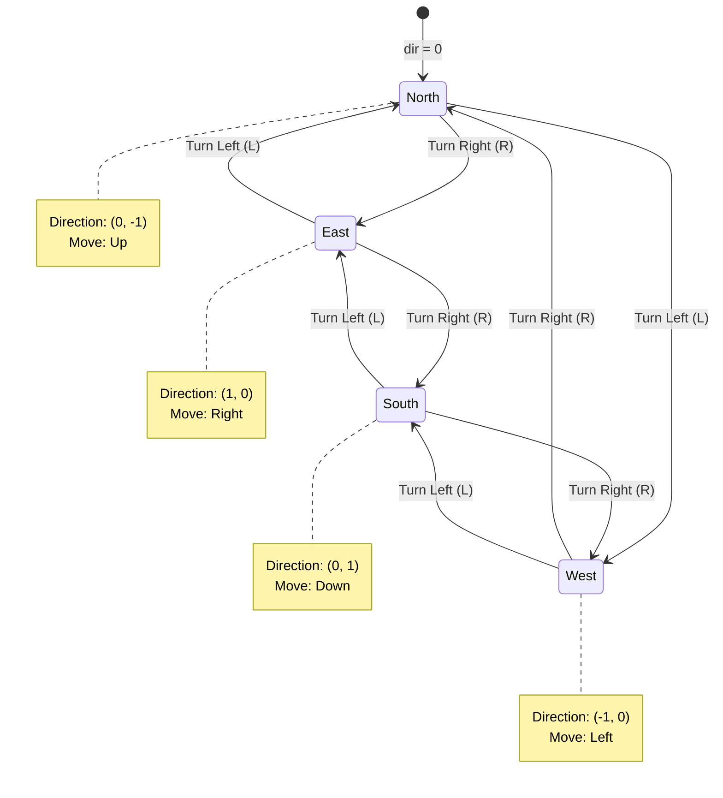

## 4. Complete Turmite System Architecture

High-level system view showing all components

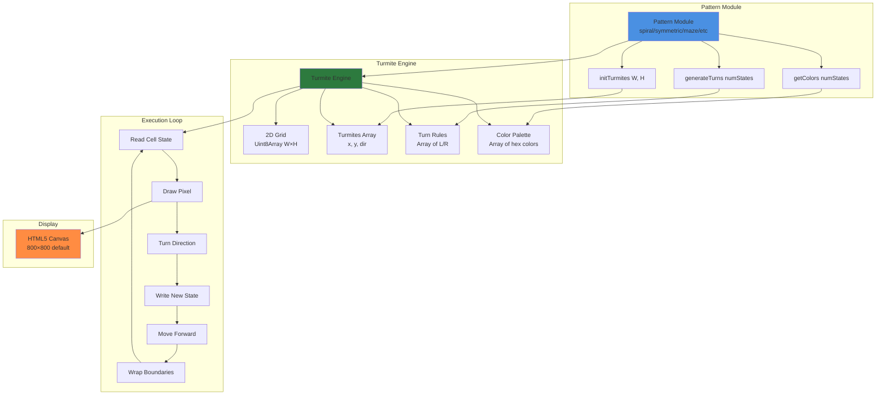

## 5. Example: Spiral Pattern State Machine

Specific example with 4 states (typical spiral pattern)


## 6. Grid and Turmite Movement Visualization

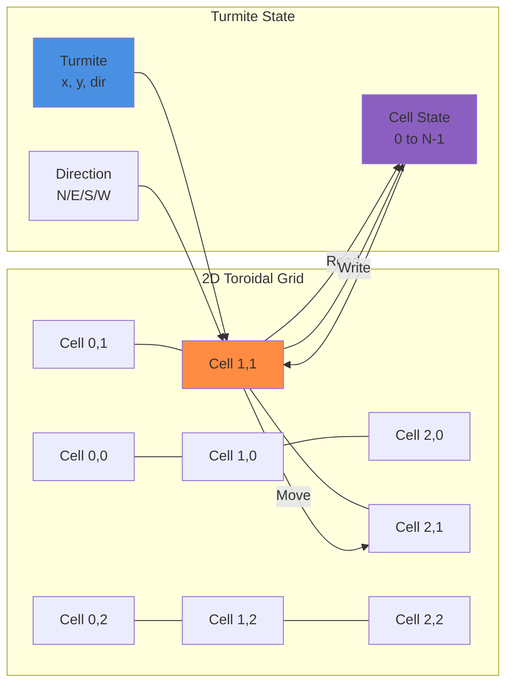

## 7. Complete Execution Cycle

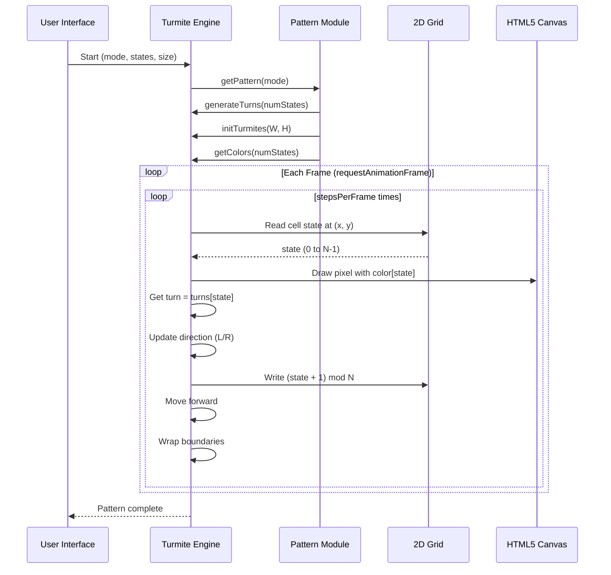

## Key Concepts

### State Transition Formula
```
New State = (Current State + 1) mod numStates
```

### Direction Update Formula
```
New Direction = (Current Direction + (turn == 'R' ? 1 : -1) + 4) mod 4
```

### Movement Formula
```
New Position = (x + DIRS[dir][0], y + DIRS[dir][1])
```

### Toroidal Wrapping
```
if x < 0: x = W - 1
if x >= W: x = 0
if y < 0: y = H - 1
if y >= H: y = 0
```

## 8. Turing Machine Table Representation

Traditional Turing machine transition table format

### Generic Turmite Transition Table

| Current State | Read Symbol | Write Symbol | Move Direction | Next State |
|--------------|-------------|--------------|----------------|------------|
| q₀ (State 0) | 0 | 1 | L or R | q₁ (State 1) |
| q₁ (State 1) | 1 | 2 | L or R | q₂ (State 2) |
| q₂ (State 2) | 2 | 3 | L or R | q₃ (State 3) |
| q₃ (State 3) | 3 | 0 | L or R | q₀ (State 0) |

**Note:** In this 2D Turmite implementation:
- **Read Symbol** = Current cell state (0 to N-1)
- **Write Symbol** = (Current state + 1) mod N
- **Move Direction** = Turn L or R based on `turns[state]`, then move forward
- **Next State** = The new cell state after writing

### Spiral Pattern Example (4 states)

| State | Turn Rule | Write | Color | Visual Effect |
|-------|-----------|-------|-------|---------------|
| 0 | R | 1 | #000000 (Black) | Background |
| 1 | R | 2 | Blue shade 1 | Spiral arm |
| 2 | R | 3 | Blue shade 2 | Spiral arm |
| 3 | L | 0 | Blue shade 3 | Corner turn |

**Rule Sequence:** `R R R L` → Creates expanding polygon (triangle with 4 states)

### Symmetric Pattern Example (4 states)

| State | Turn Rule | Write | Color | Visual Effect |
|-------|-----------|-------|-------|---------------|
| 0 | L | 1 | #000000 (Black) | Background |
| 1 | R | 2 | Green shade 1 | Symmetric path |
| 2 | L | 3 | Green shade 2 | Symmetric path |
| 3 | R | 0 | Green shade 3 | Symmetric path |

**Rule Sequence:** `L R L R` → Creates alternating symmetric patterns

## 9. Detailed State Machine with Actions

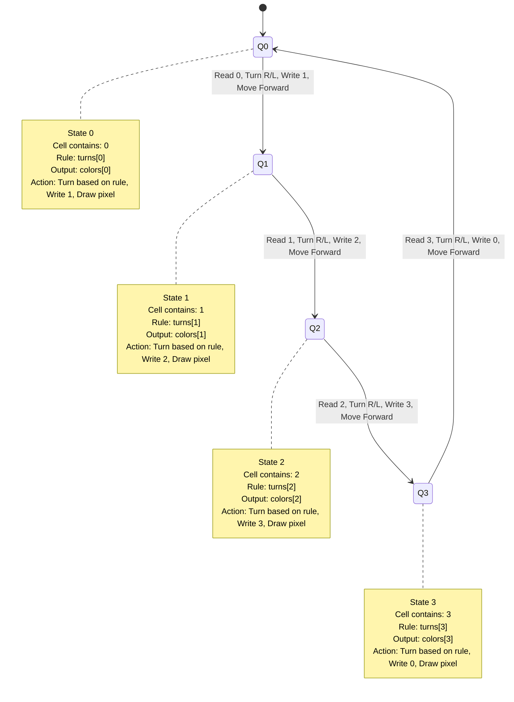

## 10. Symmetric Pattern State Machine

Creates mandala-like symmetric patterns with 4 turmites at corners

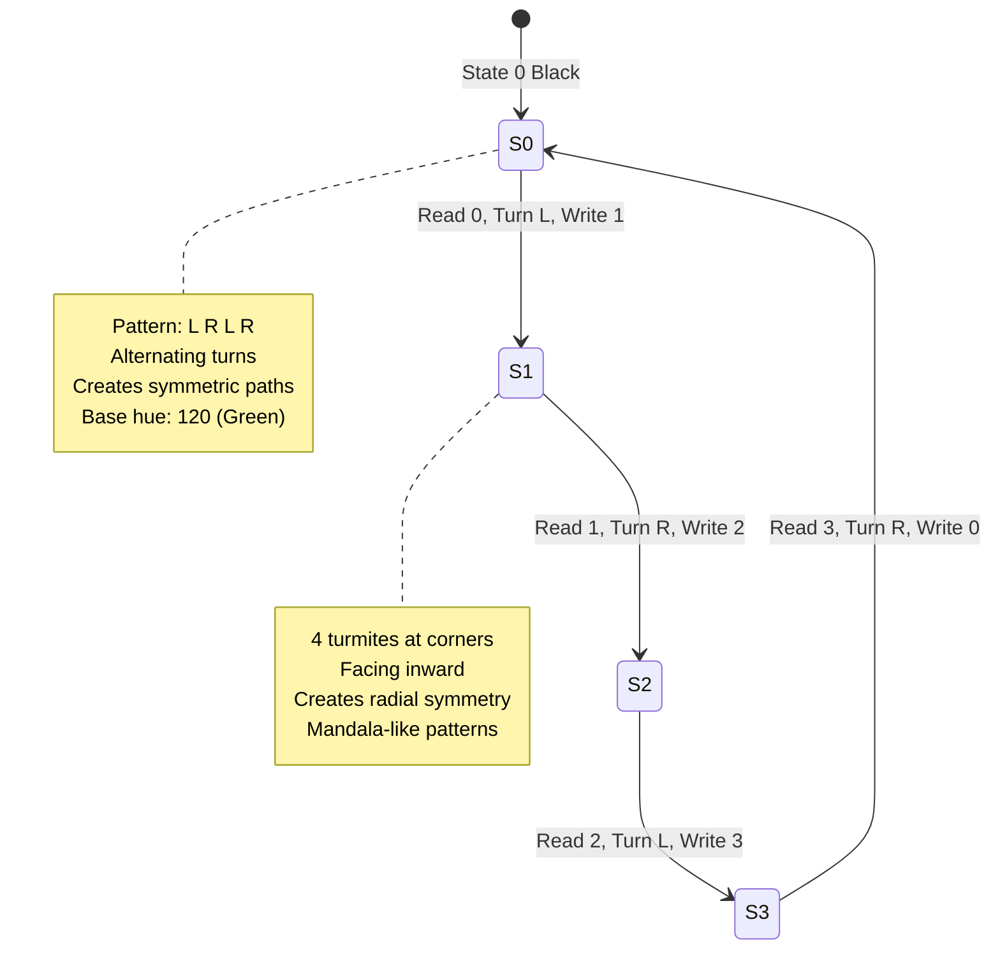

## 11. Maze Pattern State Machine

Creates maze-like branching structures

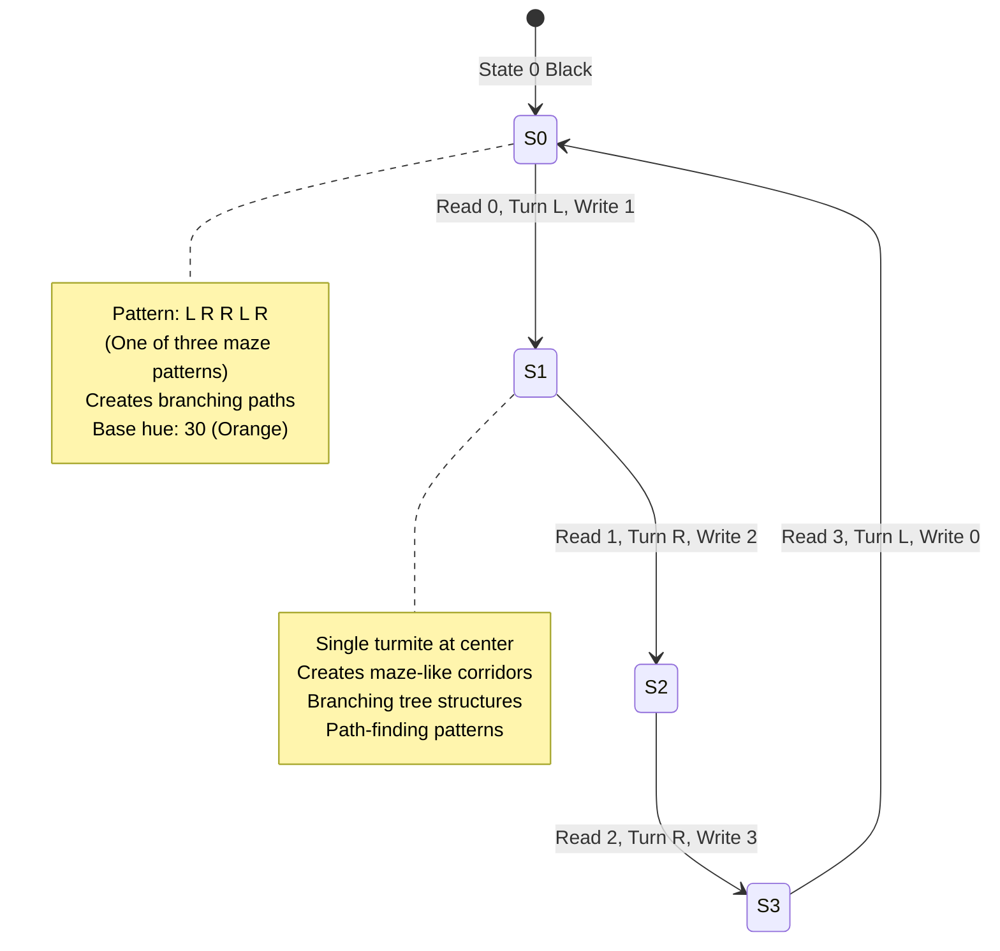

## 12. Fractal Pattern State Machine

Creates self-similar, recursive-looking patterns

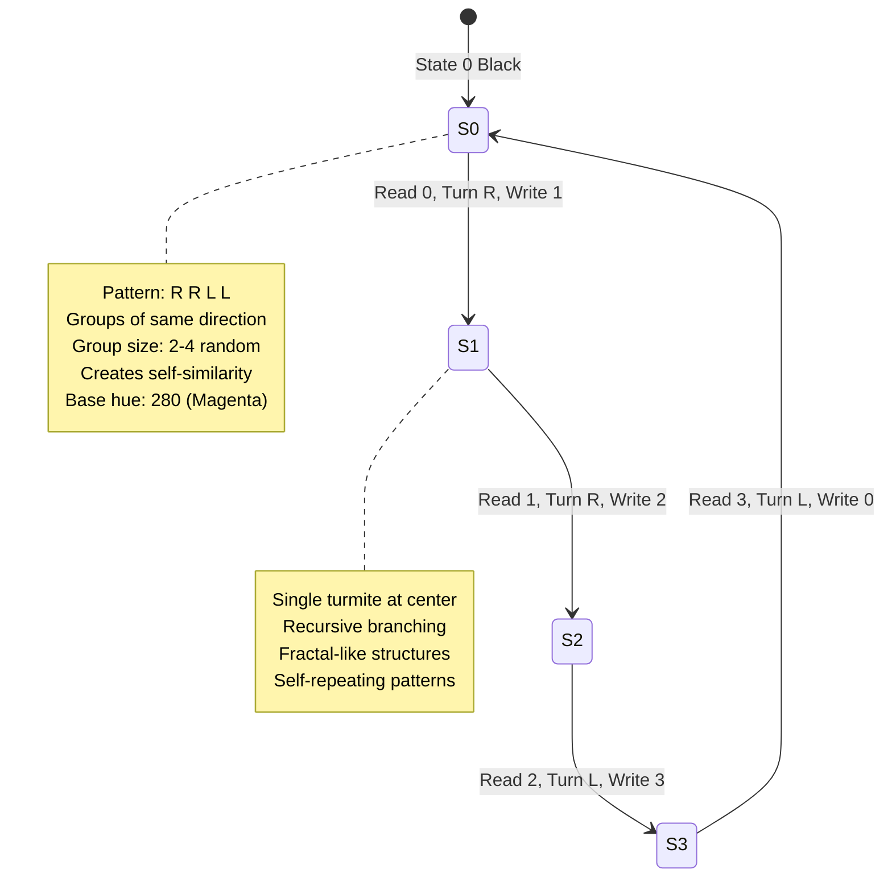

## 13. Crystal Pattern State Machine

Creates dense, blocky, city-like structures

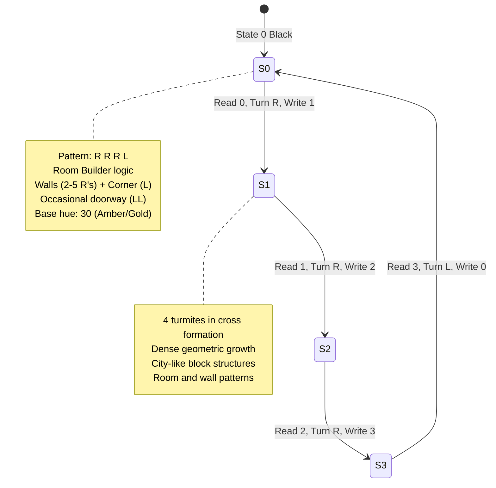

## 14. Weaver Pattern State Machine

Creates textile-like highway patterns

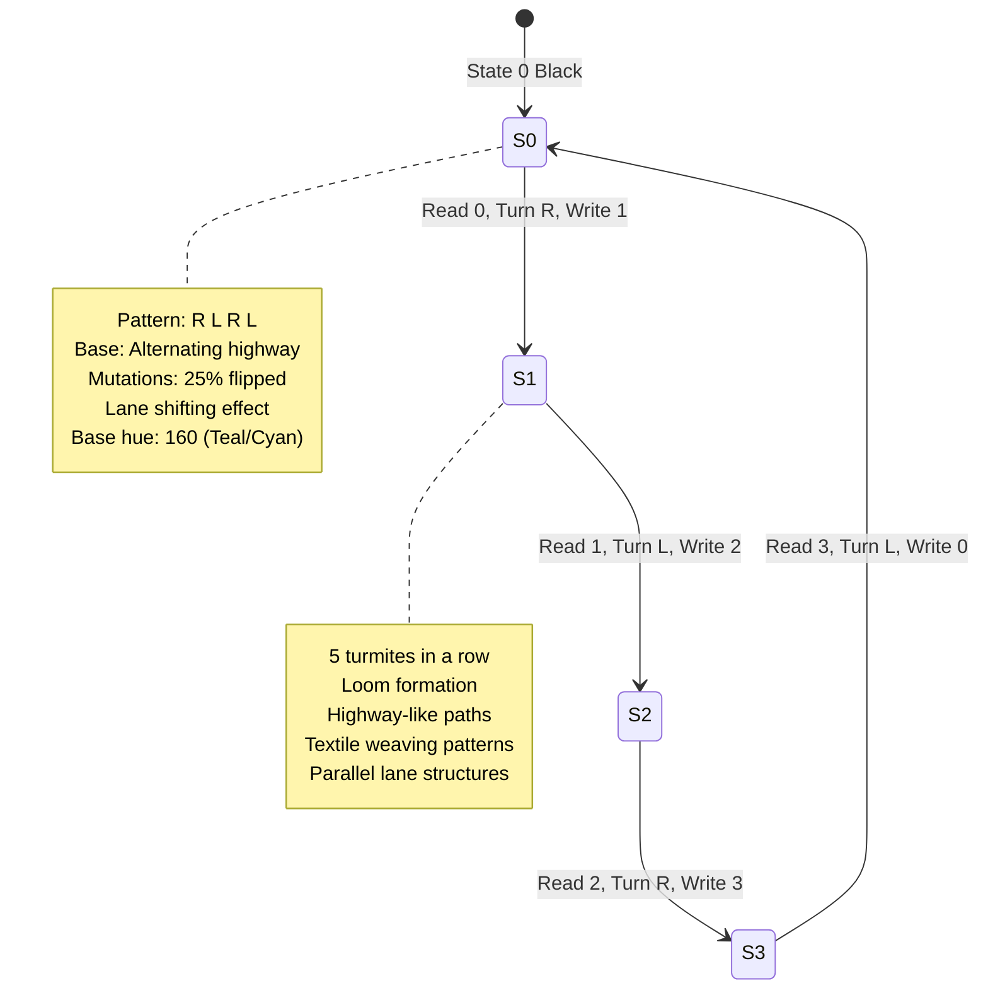

## 15. Random Pattern State Machine

Creates chaotic, unpredictable patterns (classic Langton's ant style)


## Pattern Examples Summary

### Spiral Pattern (4 states)
- Turns: `['R', 'R', 'R', 'L']`
- Creates: Expanding polygon spirals
- Formula: (N-1) Rights, 1 Left
- Turmites: 1-5 clustered at center
- Base hue: 200 (Blue)

### Symmetric Pattern (4 states)
- Turns: `['L', 'R', 'L', 'R']` (with 20% variation)
- Creates: Mandala-like symmetric patterns
- Formula: Alternating L/R
- Turmites: 4 at corners facing inward
- Base hue: 120 (Green)

### Maze Pattern (4 states)
- Turns: `['L', 'R', 'R', 'L', 'R']` (one of three patterns)
- Creates: Maze-like branching structures
- Formula: Mixed path-creating patterns
- Turmites: 1 at center
- Base hue: 30 (Orange)

### Fractal Pattern (4 states)
- Turns: `['R', 'R', 'L', 'L']` (groups of 2-4)
- Creates: Self-similar recursive patterns
- Formula: Groups of same direction
- Turmites: 1 at center
- Base hue: 280 (Magenta)

### Crystal Pattern (4 states)
- Turns: `['R', 'R', 'R', 'L']` (room builder)
- Creates: Dense blocky city-like structures
- Formula: Walls (2-5 R's) + Corner (L) + Doorway (LL)
- Turmites: 4 in cross formation
- Base hue: 30 (Amber/Gold)

### Weaver Pattern (4 states)
- Turns: `['R', 'L', 'R', 'L']` (with 25% mutations)
- Creates: Textile-like highway patterns
- Formula: Alternating base with lane shifts
- Turmites: 5 in a row (loom)
- Base hue: 160 (Teal/Cyan)

### Random Pattern (4 states)
- Turns: Random sequence (changes each run)
- Creates: Chaotic unpredictable patterns
- Formula: Random L/R for each state
- Turmites: 1 at center
- Base hue: Random (0-360)

## 16. Complete Pattern Comparison Table

Side-by-side comparison of all Turing machine patterns

| Pattern | Turn Sequence (4 states) | Turmites | Initialization | Base Hue | Visual Effect |
|---------|-------------------------|----------|----------------|----------|--------------|
| **Spiral** | R R R L | 1-5 | Center cluster | 200 (Blue) | Expanding polygon spirals |
| **Symmetric** | L R L R | 4 | Corners inward | 120 (Green) | Mandala-like radial symmetry |
| **Maze** | L R R L R | 1 | Center | 30 (Orange) | Branching maze corridors |
| **Fractal** | R R L L | 1 | Center | 280 (Magenta) | Self-similar recursive patterns |
| **Crystal** | R R R L | 4 | Cross formation | 30 (Amber) | Dense blocky city structures |
| **Weaver** | R L R L | 5 | Row (loom) | 160 (Teal) | Highway textile patterns |
| **Random** | Random | 1 | Center | Random | Chaotic unpredictable paths |

## 17. Pattern Characteristics Matrix

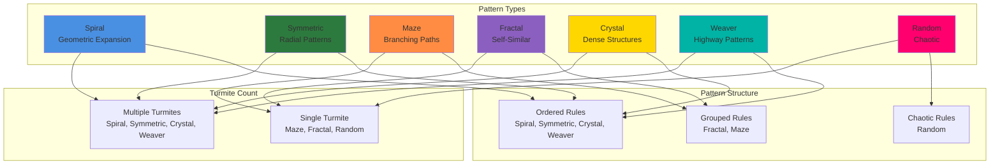

